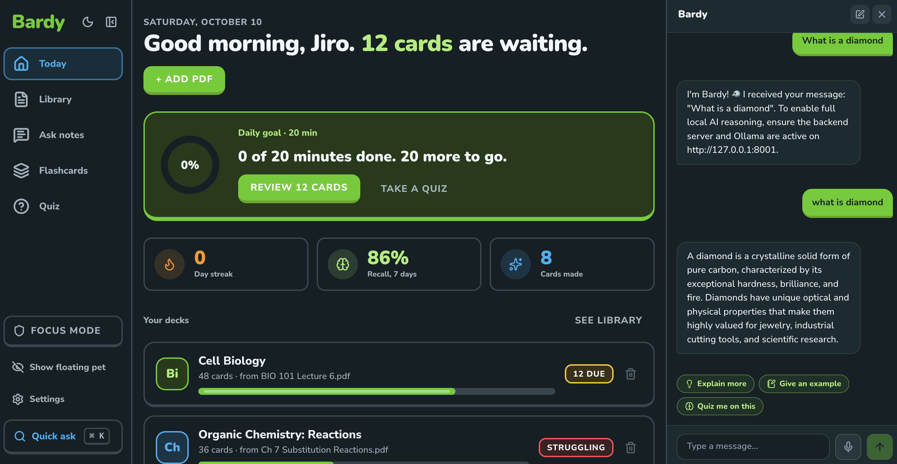

# Bardy

Bardy is an offline study companion for macOS and Windows. Import a PDF to create study material, then review flashcards, take quizzes, and ask the local AI tutor for help.

## Overview



## What you need

- Node.js 24 (`node --version` should start with `v24`)
- Python 3.10 or later
- [Ollama](https://ollama.com/) with the `llama3.2` model for AI-powered features

## Install and run

From the repository root, install and start the backend in one terminal.

**macOS/Linux**

```sh
python3.12 -m venv .venv
.venv/bin/python -m pip install -r backend/requirements.txt
test -f backend/.env || cp backend/.env.example backend/.env
ollama pull llama3.2
cd backend
../.venv/bin/python -m uvicorn app:app --reload
```

Use your installed Python 3.10+ command in place of `python3.12`. Keep this terminal running; the API is available at `http://127.0.0.1:8000`.

**Windows (PowerShell)**

```powershell
py -3.12 -m venv .venv
.\.venv\Scripts\python.exe -m pip install -r backend\requirements.txt
if (-not (Test-Path backend\.env)) { Copy-Item backend\.env.example backend\.env }
ollama pull llama3.2
cd backend
..\.venv\Scripts\python.exe -m uvicorn app:app --reload
```

In a second terminal, install and launch the desktop app:

```sh
cd frontend
npm install
npm run dev
```

The Bardy desktop window opens automatically. Keep both terminals running while you use AI features.

## Access the project

1. Open **Library** and add a PDF to create a study deck.
2. Use **Ask notes** or the floating Bardy assistant to ask study questions.
3. Open **Flashcards** to review a deck, or **Quiz** to test yourself.
4. Visit `http://127.0.0.1:8000/api/health` to check the API and Ollama connection; use `http://127.0.0.1:8000/docs` for interactive API documentation.

## More detail

- [Backend setup and configuration](backend/README.md)
- [Desktop development, tests, and platform notes](frontend/README.md)
